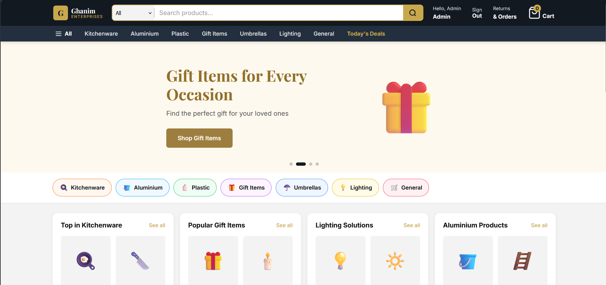
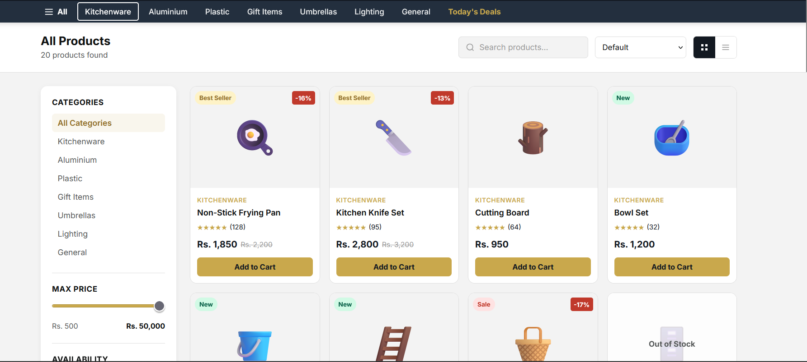
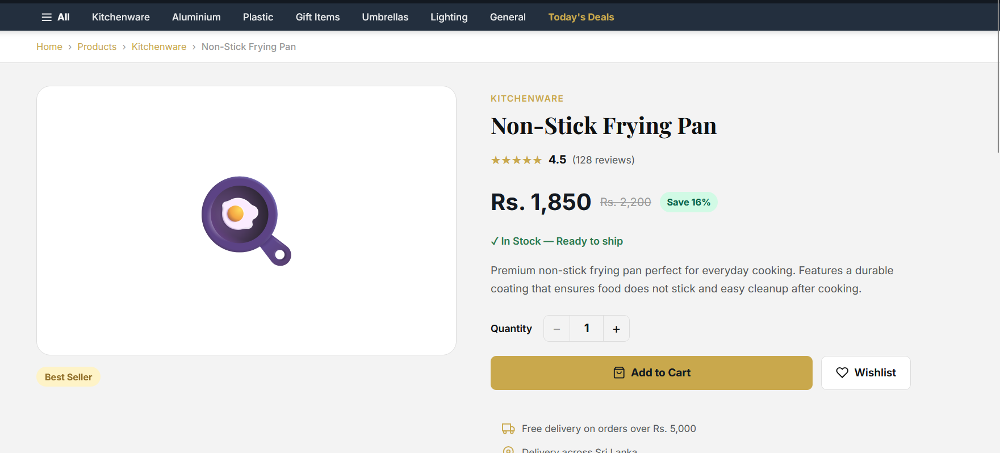
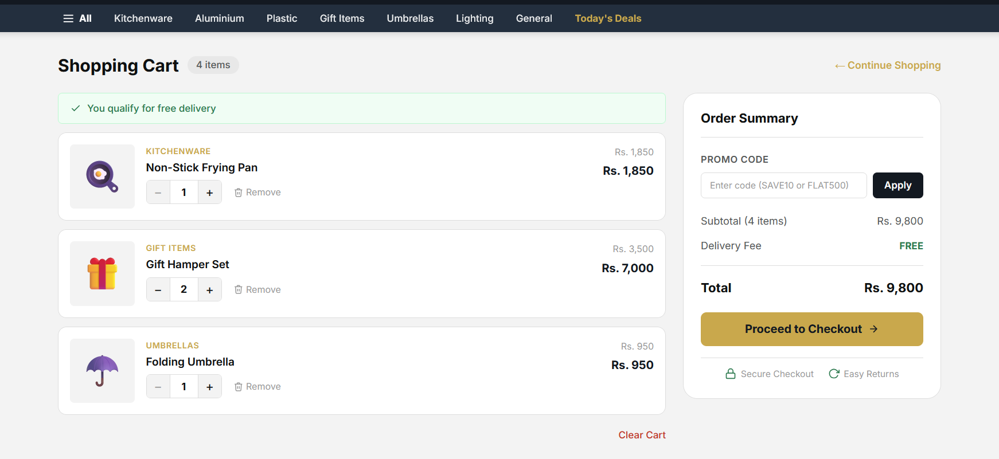
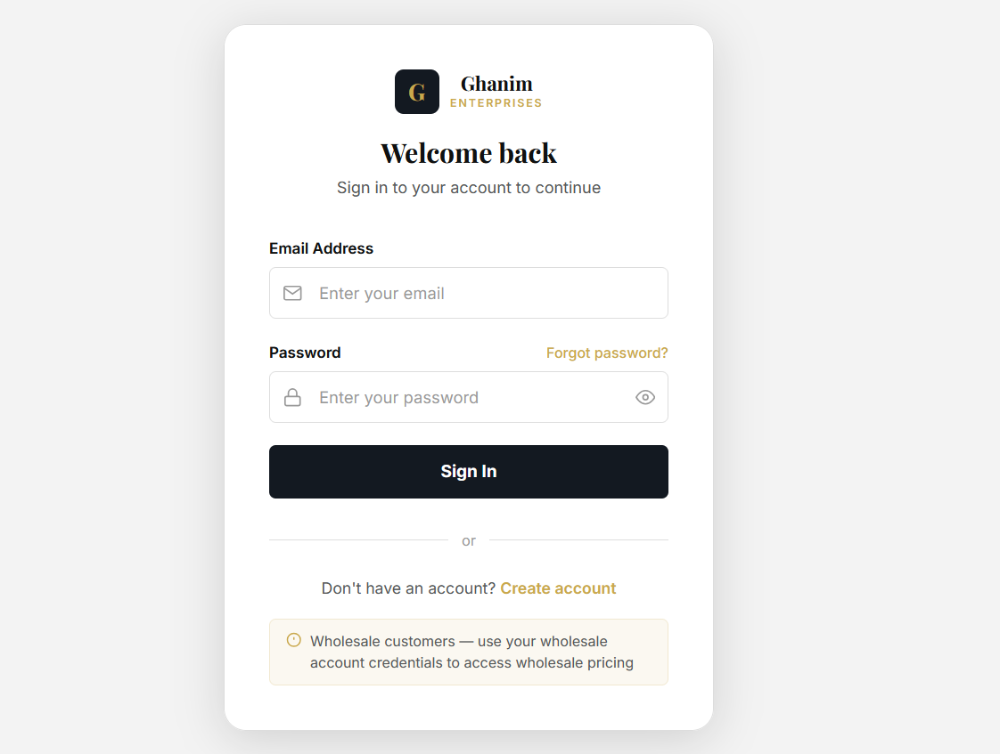
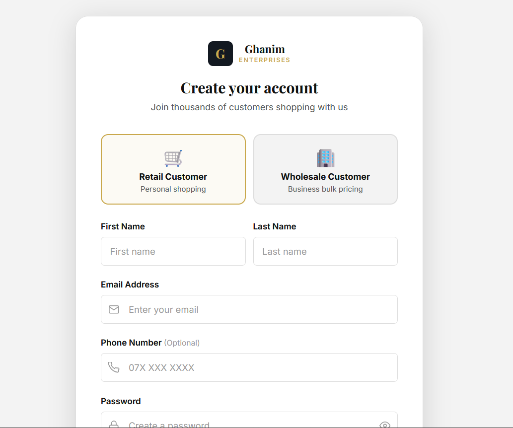
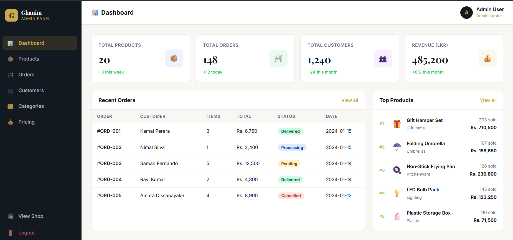
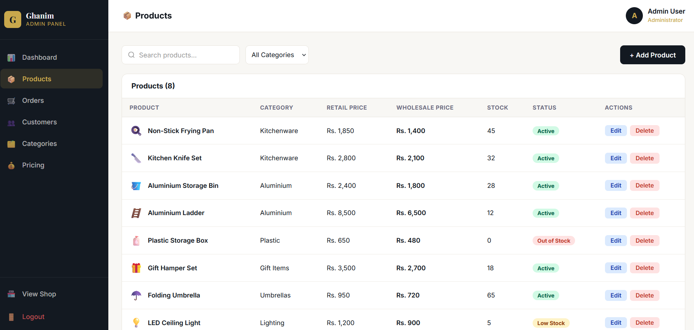
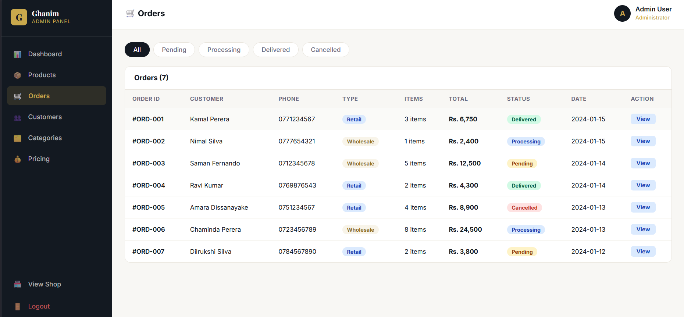

# Ghanim Enterprises — Full Stack E-Commerce Platform

A modern full-stack e-commerce web application built with **Angular 21** and **Spring Boot**, featuring retail and wholesale pricing, AI-powered smart search, and chatbot support.


---

## 🖥️ Live Demo
> Coming soon after deployment

---

## 📸 Screenshots

### Homepage


### Product Catalog


### Product Detail


### Shopping Cart


### Login Page


### Register Page


### Admin Dashboard


### Admin Products


### Admin Orders


---

## ✨ Features

### Customer Features
- Browse products by category with smart filtering and sorting
- Grid and list view toggle on product catalog
- Product detail page with specifications, tabs, and related products
- Shopping cart with promo code support and free delivery threshold
- Retail and wholesale pricing based on account type
- AI-powered smart search (coming soon)
- AI chatbot for product assistance (coming soon)

### Admin Features
- Dashboard with sales stats, recent orders, and top products
- Full product management — add, edit, delete with retail and wholesale pricing
- Order management with status filtering
- Customer and category management (coming soon)

### Auth & Security
- JWT-based authentication
- Role-based access control — Retail, Wholesale, Admin
- Protected routes with Angular guards
- HTTP interceptor for automatic token attachment

---

## 🛠️ Tech Stack

### Frontend
| Technology | Purpose |
|---|---|
| Angular 21 | Frontend framework |
| TypeScript | Language |
| SCSS + BEM | Styling |
| Angular Signals | State management |
| Angular Router | Navigation and lazy loading |
| HttpClient | API communication |

### Backend (In Progress)
| Technology | Purpose |
|---|---|
| Spring Boot 3 | REST API |
| Spring Security | Authentication and authorization |
| JWT | Token-based auth |
| Spring Data JPA | Database ORM |
| PostgreSQL | Primary database |
| pgvector | Vector search for AI features |

### AI Features (Planned)
| Technology | Purpose |
|---|---|
| OpenAI Embeddings | Smart search vectors |
| pgvector | Vector similarity search |
| Claude API | AI chatbot |

---

## 🚀 Getting Started

### Prerequisites
- Node.js 22+
- Angular CLI 21+
- Java 21+
- PostgreSQL 16+

### Frontend Setup

```bash
# Clone the repository
git clone https://github.com/Inscode/ecommerce-angular-springboot.git

# Navigate to frontend
cd ghanim-enterprises

# Install dependencies
npm install

# Start development server
ng serve
```

Open `http://localhost:4200` in your browser.

### Test Accounts

| Email | Password | Role |
|---|---|---|
| admin@ghanim.lk | admin123 | Admin |
| wholesale@ghanim.lk | wholesale123 | Wholesale |
| any@email.com | any123 | Retail |

---

## 📁 Project Structure

```
src/
├── app/
│   ├── core/
│   │   ├── guards/          # Auth and role guards
│   │   ├── interceptors/    # JWT interceptor
│   │   ├── models/          # TypeScript interfaces
│   │   └── services/        # Auth service
│   ├── features/
│   │   ├── home/            # Homepage
│   │   ├── products/        # Catalog and detail pages
│   │   ├── cart/            # Shopping cart
│   │   ├── auth/            # Login and register
│   │   ├── admin/           # Admin panel
│   │   └── wholesale/       # Wholesale views (planned)
│   └── shared/
│       └── components/      # Navbar and footer
└── environments/            # Environment config
```

---

## 🗺️ Roadmap

- [x] Angular project setup and global styles
- [x] Amazon-style navbar with search
- [x] Homepage with banner slider and product widgets
- [x] Product catalog with filters and sort
- [x] Product detail page with tabs
- [x] Shopping cart with promo codes
- [x] Login and register with validation
- [x] JWT auth service and guards
- [x] Admin panel — dashboard, products, orders
- [ ] Spring Boot REST API
- [ ] PostgreSQL database design
- [ ] JWT authentication backend
- [ ] Connect Angular to Spring Boot
- [ ] Wholesale price switching by role
- [ ] Smart search with pgvector
- [ ] AI chatbot integration
- [ ] Deployment

---

## 👨‍💻 Author

Built by **Insaf** as a full-stack portfolio project covering Angular, Spring Boot, PostgreSQL, and AI integration.

---

## 📄 License

This project is open source and available under the [MIT License](LICENSE). 
